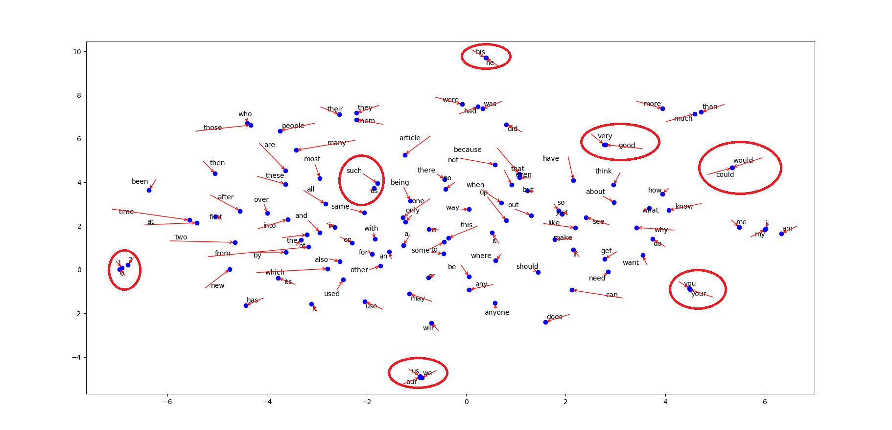

# TrainWord2Vec_WikiCorpus
使用英文维基百科训练一个word2vec模型，并对其进行实验
## 环境
- Intel(R) Core(TM) i7-8550U & 16G RAM
- Anaconda 3.0
- gensim

## 获取语料

​	训练词向量的第一步是取得一个合适的数据集。word2vec是基于非监督式学习的，一般情况下我们需要数据集语料越大越全的，这样才会训练出一个较为理想的模型。挑选数据集是维基百科定期更新的词条语料。
​	选择下载的是[**enwiki-20200620-pages-articles.xml.bz2数据集**](https://dumps.wikimedia.org/enwiki/)（*注意：不是enwiki-20200620-pages-articles-multistream.xml.bz2 结尾的数据集*），否则在处理时会出现一些异常而无法解析。该数据集使用原生链接下载非常慢，推荐使用**迅雷工具下载**(大约一小时左右)

​	下载等待的时间，首先安装好gensim，本教程使用gensim来训练word2vec模型。在anaconda prompt使用命令行：
```
pip install --upgrade gensim
```
​	出现以下successfully built smart open则为成功。


​	维基百科语料下载完成，得到的是一份xml文件，不用担心怎么使用，gensim内置的WikiCorpus类可以方便提取
文章的标题与内容。具体方法是get_texts( )。

```python
import logging
import sys

from gensim.corpora import WikiCorpus

def main():

    if len(sys.argv) != 2:
        print("Usage: python3 " + sys.argv[0] + " wiki_data_path")
        exit()

    logging.basicConfig(format='%(asctime)s : %(levelname)s : %(message)s', level=logging.INFO)
    wiki_corpus = WikiCorpus(sys.argv[1], dictionary={})
    texts_num = 0

    with open("wiki_texts.txt",'w',encoding='utf-8') as output:
        for text in wiki_corpus.get_texts():  # 读入xml文件
            output.write(' '.join(text) + '\n')
            texts_num += 1
            if texts_num % 10000 == 0: # 每处理10000条-显示
                logging.info("已处理 %d 篇文章" % texts_num)

if __name__ == "__main__":
    main()

```

- get_texts()：迭代每一篇文章，返回一个tokens list
- WikiCorpus，wiki数据的抽取处理类，能对下载的数据（articles.xml.bz2）进行抽取处理，得到纯净的文本语料。


  运行process_wiki.py，经过很久，显示 *Finished Saved 4860724 articles* ，可以看到，维基百科2020/06/20的备份，文章共4860724篇。

```
C:\Users\baiyo\anaconda3\lib\site-packages\gensim\utils.py:1268: UserWarning: detected Windows; aliasing chunkize to chunkize_serial
  warnings.warn("detected %s; aliasing chunkize to chunkize_serial" % entity)
2020-07-01 17:30:36,095 : INFO : 已处理 10000 篇文章
2020-07-01 17:32:16,685 : INFO : 已处理 20000 篇文章
....
2020-07-01 21:51:06,776 : INFO : 已處理 4850000 篇文章
2020-07-01 21:51:38,642 : INFO : 已處理 4860000 篇文章
2020-07-01 21:51:41,850 : INFO : finished iterating over Wikipedia corpus of 4860724 documents with 2755160976 positions (total 20358442 articles, 2827402342 positions before pruning articles shorter than 50 words)
```

（文件很大，使用notepad++打开会死机）采取文件打开方法查看前300个字符

```python
filename ="C:\ProgramData\wordvec\wiki_texts.txt";
try:
	fp = open(filename,"r");
	print("%s 文件打开成功" %filename);
	content = fp.read(300); # read()函数
	fp.close();
	print("读取文件的内容");
	print(content);
except IOError:
	print("文件打开失败，%s文件不存在" %filename);
    
#	anarchism is political philosophy and movement that rejects all involuntary coercive forms of hierarchy #  it radically calls for the abolition of the state which it holds to be undesirable unnecessary and     
#   harmful the timeline of anarchism stretches back to prehistory when humans lived in anarchistic s
```

## 词向量训练

在anaconda prompt输入：

 `python train_word2vec_model.py`

```python
import logging
from gensim.models import word2vec

def main():

    logging.basicConfig(format='%(asctime)s : %(levelname)s : %(message)s', level=logging.INFO)
    sentences = word2vec.LineSentence("wiki_texts.txt")
    model = word2vec.Word2Vec(sentences, size=250,window=5, min_count=5,workers=multiprocessing.cpu_count())

    #保存模型
    model.save("word2vec.model")

if __name__ == "__main__":
    main()
```

等待许久

显示如下则代表训练完成

```
2020-07-02 02:34:41,249 : INFO : EPOCH - 5 : training on 2755160976 raw words (2235976254 effective words) took 2987.3s, 748503 effective words/s
2020-07-02 02:34:41,249 : INFO : training on a 13775804880 raw words (11180001386 effective words) took 14863.2s, 752193 effective words/s
2020-07-02 02:34:41,251 : INFO : saving Word2Vec object under word2vec.model, separately None
2020-07-02 02:34:41,251 : INFO : storing np array 'vectors' to word2vec.model.wv.vectors.npy
2020-07-02 02:34:46,133 : INFO : not storing attribute vectors_norm
2020-07-02 02:34:46,133 : INFO : storing np array 'syn1neg' to word2vec.model.trainables.syn1neg.npy
2020-07-02 02:34:54,677 : INFO : not storing attribute cum_table
2020-07-02 02:34:59,399 : INFO : saved word2vec.model
```

下面使用word2vec训练词向量最核心的部分，代码较为简单，但困难在于参数的微调训练。去掉logging后只剩下几行，其中核心是：

```python
class gensim.models.word2vec.Word2Vec(sentences=None, size=100, alpha=0.025, window=5, min_count=5, max_vocab_size=None, sample=0.001, seed=1, workers=3, min_alpha=0.0001, sg=0, hs=0, negative=5, cbow_mean=1, hashfxn=<built-in function hash>, iter=5, null_word=0, trim_rule=None, sorted_vocab=1, batch_words=10000)
```
初学者会了解到的一些参数有：
- sentences ：要训练的句子集合
- size ：表示训练出的词向量有几维
- alpha ：机器学习中的学习率，逐渐收敛于min_count
- window ：当前词能前后看的字数
- workers ：线程数目，一般不大于4
- min_count ：若某个词出现的次数小于min_count，那它就不会被视为训练对象

## 词向量实验

运行 `python test_word2vec.py`:

```python
from pyemd import emd
import gensim
# import gensim.models import Word2Vec

# 模型读取方式
model = gensim.models.Word2Vec.load('C:\ProgramData\wordvec\word2vec.model');

# 查看词向量 | 维度
vec = model['man'];
print('man:',vec);
print('Shape:',vec.shape);
# man [ 2.21187860e-01  3.63909841e+00 ..... 
#      -7.56549418e-01 -2.68334198e+00] 250维向量

# 前N个最相似词
words = model.most_similar("queen");
print("The most similar words: ");
for w in words:
    print(w);
    
# 余弦相似度(w1,w2)
similar_rate = model.similarity("man","woman");
print(similar_rate);  
# 0.7089453

result = model.similar_by_word("cat");
print(result);
# ('dog', 0.755760908126831),

# 余弦相似度(v1,v2)
similar_rate = model.n_similarity(['sushi', 'shop'], ['japanese', 'restaurant']);
print(similar_rate);  
# 0.6058457

# 找不属于同一类的word
word = model.doesnt_match("woman man cat boy".split());
print(word);

# 词移动距离
sentence_obama = 'Obama speaks to the media in Illinois'.lower().split()
sentence_president = 'The president greets the press in Chicago'.lower().split()
dis = model.wmdistance(sentence_obama, sentence_president)
print(dis); 
# 23.09102023507841

```

## Note

- 获取语料：运行process_wiki.py，大约4小时多后，得到 15.8G的wiki_texts.txt文件

- 训练模型：运行train_word2vec_model，大约5小时后得大小为153M的word2vec.model文件

- 将min_count设置为2000，重新训练，使用t-SNE将单词向量降到二维可视平面，用Matplot绘制降维结果，模型可以分类出很多相关语义组。

  
